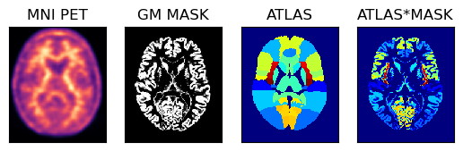

# AmyPET: Advanced Brain PET Imaging Platform for Neurodegenerative Disease Research

AmyPET is an advanced and open-source software package written in Python to provide all necessary tools for image analysis of static and dynamic PET image data.  The recommended image data is the raw DICOM image data exported from a PET scanner without modifications to obtain all necessary information about the frame timings, the PET radiopharmaceutical used, injection time, etc.

The key features include:

- Automated calibration with the original GAAIN PET and MR datasets for each tracer and for any modification of the original/base Centiloid pipeline.
- Dedicated for research purposes by enabling highly flexible processing pipelines (e.g., native or MNI PET space sampling, generates CL images in any space)
- Comprehensive Quality Control for each stage of processing – generates QC output folders for alignment, image registration, spatial non-rigid normalisation.
- Support for dynamic coffee break protocols and advanced alignment using PET frames or CT scans.
- Support for amyloid, tau and TSPO tracers.


## Centiloid calculations with advanced image analysis using AmyPET

First, import all necessary Python packages


```python
from pathlib import Path
import numpy as np
from matplotlib import pyplot as plt
from niftypet import nimpa
import spm12
import amypet
from amypet import backend_centiloid as centiloid
from amypet import params as Cnt

import logging
logging.basicConfig(level=logging.INFO)
```

### Set up the input and output


```python
# > ignore derived DICOM files
ignore_derived = False

# > uptake ratio (UR) window def (unfortunately, aka SUVr)
ur_win_def = [5400,6600]

# > type of amyloid radiopharmaceutical, here [18F]florbetaben
tracer = 'fbb'

# > input PET folder
input_fldr = Path('/home/pawel/data/PNHS/FBB1_STAT')

# > output path
outpath = input_fldr.parent/('amypet_output_'+input_fldr.name) 
```

### Explore, identify DICOM files and convert to NIfTI

Please note, that in order to obtain the relevant information about PET acquisition, key DICOM fields have to be present.  Among others (such as image orientation and size), these are:
- study time and date
- series time
- acquisition time
- frame duration time
- time of tracer administration (start)
- PET tracer name (not always accurate or present; can be overwritten by specifying it upfront when running AmyPET).

```python
#------------------------------
# > structural/T1w image
ft1w = amypet.get_t1(input_fldr, Cnt)

if ft1w is None:
    raise ValueError('Could not find the necessary T1w DICOM or NIfTI images')
#------------------------------

#------------------------------
# > processed the PET input data and classify it (e.g., automatically identify UR frames)
indat = amypet.explore_indicom(
    input_fldr,
    Cnt,
    tracer=tracer,
    find_ur=True,
    ur_win_def=ur_win_def,
    outpath=outpath/'DICOMs')

# > convert to NIfTIs
niidat = amypet.convert2nii(indat, use_stored=True)
#------------------------------
```

### Align the dynamic/static frames

This does not have to be executed if only one PET frame is available


```python
aligned = amypet.align(
    niidat,
    Cnt,
    reg_tool='spm',
    ur_fwhm=4.5,
    use_stored=True)
```

### CL qunatification


```python
# > optional CSV file output for CL results 
fcsv = input_fldr.parent/(input_fldr.name+'_AmyPET_CL.csv')

out_cl = centiloid.run(
    aligned['ur']['fur'],
    ft1w,
    Cnt,
    stage='f',
    voxsz=1,
    bias_corr=True,
    tracer=tracer,
    outpath=outpath/'CL1',
    use_stored=True,
    #fcsv=fcsv
    )
```

### MNI analytics

The extra analysis can use either the MNI normalised PET images, or the output CL images

### Obtain all the atlases

The available atlases include:
- Hammers atlas (you will be promted to fill the online license)
- DKT (Desikan-Killiany-Tourville) atlas
- Schaefer atlas
- AAL atlas


```python
# > get the available atlases in the MNI space as Python dicionaries
hmr = amypet.get_atlas(atlas='hammers')
dkt = amypet.get_atlas(atlas='dkt')
sch = amypet.get_atlas(atlas='schaefer')
aal = amypet.get_atlas(atlas='aal')
```

All the atlases come with the sub-dictionaries of available labels and names. For example, for the Hammers atlas, we can find the following dictionary items:


```python
hmr.keys()
```


    dict_keys(['fatlas', 'fatlas_full', 'flabels', 'voi_lobes', 'vois'])


with `vois` and `voi_lobes` representing the different labels for all the available volumes of interests (VOI) and the composite VOIs for the lobes of the brain.  Please note that the Hammers atlas has the full version (including the white matter, WM) and the grey matter (GM) version.

### Atlas resampling to the PET image size


```python
# > Hammers atlas - the grey matter version
fhmr = spm12.resample_spm(
    out_cl['fnorm'][1],
    hmr['fatlas'],
    np.eye(4),
    intrp=0,
    fimout=Path(out_cl['fnorm'][1]).parent/('InPET_'+hmr['fatlas'].name),
    del_ref_uncmpr=True,
    del_flo_uncmpr=True,
    del_out_uncmpr=True)

# > Hammers atlas - full version with the WH
fhmrf = spm12.resample_spm(
    out_cl['fnorm'][1],
    hmr['fatlas_full'],
    np.eye(4),
    intrp=0,
    fimout=Path(out_cl['fnorm'][1]).parent/('InPET_'+hmr['fatlas_full'].name),
    del_ref_uncmpr=True,
    del_flo_uncmpr=True,
    del_out_uncmpr=True)

fdkt = spm12.resample_spm(
    out_cl['fnorm'][1],
    dkt['fatlas'],
    np.eye(4),
    intrp=0,
    fimout=Path(out_cl['fnorm'][1]).parent/('InPET_'+dkt['fatlas'].name),
    del_ref_uncmpr=True,
    del_flo_uncmpr=True,
    del_out_uncmpr=True)

fsch = spm12.resample_spm(
    out_cl['fnorm'][1],
    sch['fatlas'],
    np.eye(4),
    intrp=0,
    fimout=Path(out_cl['fnorm'][1]).parent/('InPET_'+sch['fatlas'].name),
    del_ref_uncmpr=True,
    del_flo_uncmpr=True,
    del_out_uncmpr=True)

faal = spm12.resample_spm(
    out_cl['fnorm'][1],
    aal['fatlas'],
    np.eye(4),
    intrp=0,
    fimout=Path(out_cl['fnorm'][1]).parent/('InPET_'+aal['fatlas'].name),
    del_ref_uncmpr=True,
    del_flo_uncmpr=True,
    del_out_uncmpr=True)
```

### Demonstration of PET image analysis with the GM probability mask and Hammers atlas

Below is an example of using the PET image in the MNI space with the corresponding GM probability mask (thus avoiding some partial volume problems during sampling) and the full Hammers atlas with segmentations for the GM and WM. 


```python
# > get the Numpy array representing the Hammers atlas image
ihmrf= nimpa.getnii(fhmrf)

# > the the Numpy array of the PET image in the MNI space
petmni = nimpa.getnii(out_cl['fnorm'][1])

# > get the corresponding GM probability mask Numpy array
gm_mni = nimpa.getnii(out_cl['fnorm'][2])

# > plot the images
fig,axs = plt.subplots(1,4)
axs[0].matshow(petmni[100,...], cmap='magma')
axs[1].matshow(gm_mni[100,...], cmap='gray')
axs[2].matshow(ihmrf[100,...], cmap='jet')
axs[3].matshow(ihmrf[100,...]*gm_mni[100,...], cmap='jet')

# > remove ticks
for i in range(4):
    axs[i].axes.get_xaxis().set_ticks([])
    axs[i].axes.get_yaxis().set_ticks([])

axs[0].set_title('MNI PET')
axs[1].set_title('GM MASK')
axs[2].set_title('ATLAS')
axs[3].set_title('ATLAS*MASK');
```


    

    


### Perform the extraction of average VOI values

For simplicity here we use the composite lobe VOIs:


```python
vois = amypet.extract_vois(
    petmni,
    fhmrf, # uses full atals
    hmr['voi_lobes'],
    atlas_mask=gm_mni, # applies the GM mask on top of the full Hammers atals
    outpath=outpath/'MNI_masks', # path to the masks
    output_masks=True # output all the individual masks for each composite VOI
)
```

### Average value for the cingulate gyrus


```python
print('The average value in the cingulate gyrus is avg = {}. The number of voxles (also partial) is nvox = {}.'.format(vois['CG']['avg'], vois['CG']['vox_no']))
```

    The average value in the cingulate gyrus is avg = 9066.670901759866. The number of voxels (also partial) is nvox = 26160.29958630912.
